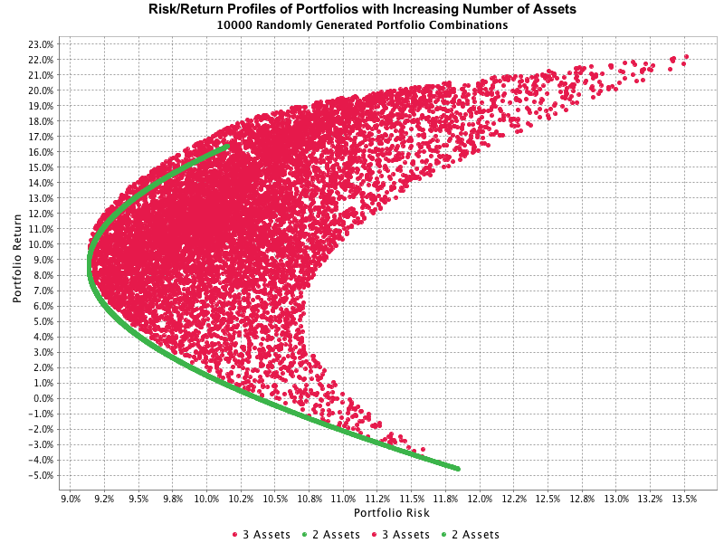

= Portfolio Analysis in Java image:https://github.com/manoelcampos/portfolio-analysis-java/workflows/maven/badge.svg[GitHub Workflow Status]

A Java 11 project for generation and analysis of financial portfolios applying the
Modern Portfolio Theory (MPT).

The project uses the https://github.com/zavtech[ZavTech Morpheus Library] to
generate random portfolios for groups os assets (stocks) extracted
from the http://finance.yahoo.com"[Yahoo Finance WebSite] using
the http://www.zavtech.com/morpheus/docs/providers/yahoo/[morpheus-yahoo unofficial API].

The image below shows an example of the graph generated for groups of
N random generated portfolios, each group containing a different number
of assets.

== Credits

This example was based on the code available at the
http://www.zavtech.com/morpheus/docs/examples/mpt/#multiple-assets[documentation page]
for the https://github.com/zavtech[ZavTech Morpheus Library]
by https://github.com/Zavster[Xavier Witdouck].

The example extracted from the library documentation
(aimed to be direct and succinct) was totally refactored and documented, extracting
several methods to make it easier to (i) reuse and  (ii) understand the code
and the data structures.
